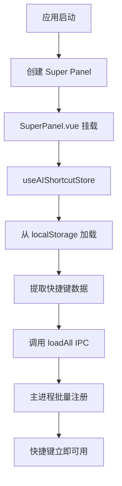
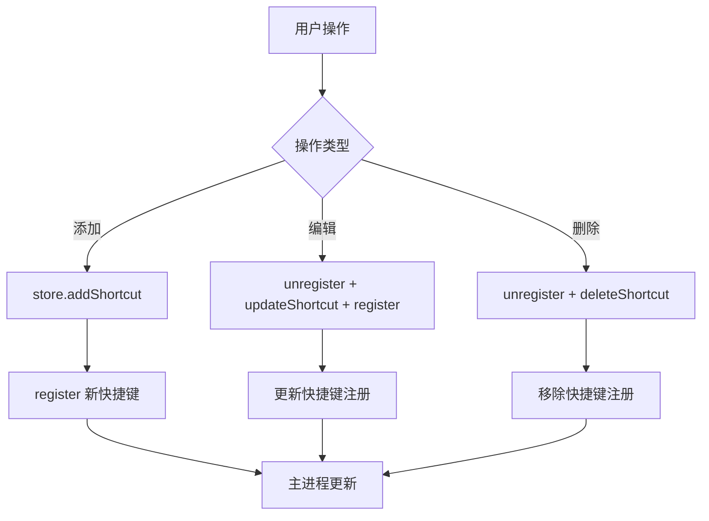

# AI 快捷键架构设计（最佳实践）

## 概述

本文档描述了 AI 快捷指令的快捷键注册和管理的最佳实践架构设计，避免了代码冗余和多处注册导致的维护问题。

## 设计原则

### 单一职责原则 (Single Responsibility Principle)

- **SuperPanel** - 负责应用启动时的批量加载
- **AIShortcut** - 负责用户操作时的增量更新

### 关注点分离 (Separation of Concerns)

```
┌─────────────────────────────────────────────────────────┐
│                    应用启动                              │
│                       ↓                                  │
│              SuperPanel.vue                              │
│        [批量加载所有快捷键一次]                           │
└─────────────────────────────────────────────────────────┘

┌─────────────────────────────────────────────────────────┐
│                   用户操作                               │
│                       ↓                                  │
│              AIShortcut.vue                              │
│  [添加] → 注册新快捷键                                   │
│  [编辑] → 注销旧的 + 注册新的                            │
│  [删除] → 注销快捷键                                     │
└─────────────────────────────────────────────────────────┘
```

## 架构设计

### 1. 启动时加载（SuperPanel.vue）

**位置**: `src/renderer/src/SuperPanel.vue`

**职责**:

- 应用启动时执行一次
- 从 localStorage 读取所有快捷指令
- 批量注册所有快捷键到主进程

**代码**:

```typescript
onMounted(async () => {
  // ... 其他初始化代码

  // 🔑 在应用启动时加载 AI 快捷指令的快捷键
  try {
    console.log('[SuperPanel] Initializing AI shortcut hotkeys...')
    const aiShortcutStore = useAIShortcutStore()

    // 从 localStorage 加载快捷指令数据
    aiShortcutStore.initialize()

    // 提取所有有快捷键的指令
    const shortcuts = aiShortcutStore.shortcuts.map((s) => ({
      id: s.id,
      name: s.name,
      icon: s.icon,
      prompt: s.prompt,
      hotkey: s.hotkey
    }))

    // 批量注册到主进程
    if (shortcuts.length > 0 && window.api?.aiShortcutHotkey?.loadAll) {
      const count = await window.api.aiShortcutHotkey.loadAll(shortcuts)
      console.log(`[SuperPanel] Successfully loaded ${count} AI shortcut hotkeys`)
    }
  } catch (error) {
    console.error('[SuperPanel] Failed to load AI shortcut hotkeys:', error)
  }
})
```

**优点**:

- ✅ 启动时立即可用
- ✅ 只执行一次，无重复注册
- ✅ 统一的初始化入口

### 2. 用户操作更新（AIShortcut.vue）

**位置**: `src/renderer/src/components/settings/AIShortcut.vue`

**职责**:

- 响应用户的增删改操作
- 增量更新快捷键注册

#### 2.1 初始化（不再批量加载）

**Before (❌ 旧代码 - 已移除)**:

```typescript
onMounted(async () => {
  store.initialize()

  // ❌ 冗余：重复加载所有快捷键
  const shortcuts = store.shortcuts.map(...)
  await window.api.aiShortcutHotkey.loadAll(shortcuts)
})
```

**After (✅ 新代码 - 最佳实践)**:

```typescript
onMounted(() => {
  // 初始化 store（从 localStorage 加载）
  // 注意：快捷键已经在 SuperPanel 启动时注册，这里只需要加载数据
  store.initialize()
  console.log('[AIShortcut] Store initialized, hotkeys already loaded by SuperPanel')
})
```

**改进**:

- ✅ 移除了重复的批量加载
- ✅ 只初始化数据，不重复注册
- ✅ 清晰的注释说明设计意图

#### 2.2 添加快捷指令

```typescript
async function handleShortcutConfirm(data) {
  if (mode === 'add') {
    const newShortcut = store.addShortcut(...)

    // 如果设置了快捷键，注册到主进程
    if (data.hotkey && newShortcut) {
      await window.api.aiShortcutHotkey.register(
        newShortcut.id,
        data.hotkey,
        newShortcut.name,
        newShortcut.icon,
        newShortcut.prompt
      )
    }
  }
}
```

#### 2.3 编辑快捷指令

```typescript
async function handleShortcutConfirm(data) {
  if (mode === 'edit') {
    const oldHotkey = currentEditingShortcut.value.hotkey

    // 先注销旧快捷键
    if (oldHotkey) {
      await window.api.aiShortcutHotkey.unregister(shortcutId)
    }

    // 更新数据
    store.updateShortcut(shortcutId, {...})

    // 注册新快捷键
    if (data.hotkey) {
      await window.api.aiShortcutHotkey.register(...)
    }
  }
}
```

#### 2.4 删除快捷指令

```typescript
function handleDeleteShortcut(shortcut) {
  confirmCallback = async () => {
    // 先注销快捷键
    if (shortcut.hotkey) {
      await window.api.aiShortcutHotkey.unregister(shortcut.id)
    }

    // 删除快捷指令
    store.deleteShortcut(shortcut.id)
  }
}
```

## 数据流图

### 应用启动流程



### 用户操作流程



## API 对比

### 批量操作 API

**使用场景**: 仅在应用启动时使用一次

```typescript
// 批量加载所有快捷键
window.api.aiShortcutHotkey.loadAll(shortcuts: Array<{
  id: string
  name: string
  icon: string
  prompt: string
  hotkey?: string
}>): Promise<number> // 返回成功注册的数量
```

**调用位置**:

- ✅ `SuperPanel.vue` - onMounted（启动时）
- ❌ ~~`AIShortcut.vue`~~ - 已移除

### 单个操作 API

**使用场景**: 用户增删改操作时

```typescript
// 注册单个快捷键
window.api.aiShortcutHotkey.register(
  shortcutId: string,
  hotkey: string,
  name: string,
  icon: string,
  prompt: string
): Promise<boolean>

// 注销单个快捷键
window.api.aiShortcutHotkey.unregister(
  shortcutId: string
): Promise<boolean>
```

**调用位置**:

- `AIShortcut.vue` - 添加/编辑/删除操作

## 为什么这样设计？

### 问题：多处加载导致的问题

**Before (旧架构)**:

```
启动 → SuperPanel 加载快捷键 ✅
     ↓
用户打开 Settings → 再次加载快捷键 ❌ (重复)
```

**问题**:

1. ❌ 代码冗余 - 两个地方做同样的事
2. ❌ 维护困难 - 修改逻辑要改两处
3. ❌ 可能不一致 - 两处实现可能有差异
4. ❌ 浪费资源 - 重复注册相同的快捷键

### 解决方案：单一加载点

**After (新架构)**:

```
启动 → SuperPanel 加载快捷键 ✅ (唯一加载点)
     ↓
用户操作 → 增量更新（register/unregister）✅
```

**优点**:

1. ✅ 单一职责 - 每个模块职责清晰
2. ✅ 易于维护 - 批量加载只在一处
3. ✅ 高效 - 启动加载一次，后续增量更新
4. ✅ 可靠 - 减少出错可能性

## 主进程处理（防御性设计）

**位置**: `src/main/modules/aiShortcutHotkeyManager.ts`

主进程的 `registerShortcutHotkey` 已经内置了重复注册保护：

```typescript
export function registerShortcutHotkey(...) {
  // 先注销旧的快捷键（如果存在）
  unregisterShortcutHotkey(shortcutId)

  // 再注册新的快捷键
  shortcutHotkeys.set(shortcutId, ...)
  hotkeyToShortcutId.set(hotkey, shortcutId)

  return true
}
```

**防御措施**:

- 自动处理重复注册
- 先注销后注册，确保干净
- 防止多次调用导致问题

## 测试验证

### 启动测试

```bash
1. 启动应用
2. 查看控制台输出：
   [SuperPanel] Initializing AI shortcut hotkeys...
   [SuperPanel] Successfully loaded X AI shortcut hotkeys
3. 不打开 Settings，直接按快捷键
4. ✅ 验证快捷键触发
```

### 操作测试

```bash
1. 打开 Settings
2. 查看控制台输出：
   [AIShortcut] Store initialized, hotkeys already loaded by SuperPanel
   (注意：没有再次加载快捷键)
3. 添加新快捷指令并设置快捷键
4. ✅ 验证新快捷键立即可用
5. 编辑快捷键
6. ✅ 验证新快捷键生效，旧的失效
7. 删除快捷指令
8. ✅ 验证快捷键被注销
```

### 代码验证

```bash
# 搜索所有调用 loadAll 的地方
grep -r "aiShortcutHotkey.loadAll" src/renderer/src/

# 应该只有一个结果：
src/renderer/src/SuperPanel.vue
```

## 文件清单

### 修改的文件

| 文件             | 修改内容                   | 状态    |
| ---------------- | -------------------------- | ------- |
| `SuperPanel.vue` | 添加快捷键批量加载逻辑     | ✅ 完成 |
| `AIShortcut.vue` | 移除批量加载，保留增量更新 | ✅ 完成 |

### 相关文件（未修改）

| 文件                          | 说明              |
| ----------------------------- | ----------------- |
| `aiShortcutRunnerHandlers.ts` | IPC handlers      |
| `aiShortcutHotkeyManager.ts`  | 快捷键管理器      |
| `aiShortcut.ts`               | AI 快捷指令 Store |
| `mouseListener.ts`            | 键盘监听          |

## 最佳实践总结

### DO ✅

1. **单一加载点** - 只在 SuperPanel 启动时批量加载
2. **增量更新** - 用户操作时只更新变化的部分
3. **清晰注释** - 说明设计意图和原因
4. **防御性编程** - 主进程处理重复注册
5. **职责分离** - 每个模块职责清晰

### DON'T ❌

1. **多处批量加载** - 避免在多个地方调用 `loadAll`
2. **重复注册** - 避免重复注册相同的快捷键
3. **混乱的职责** - 不要让多个模块做同样的事
4. **缺少注释** - 复杂逻辑要有清晰说明
5. **假设初始化** - 不要假设数据已经加载

## 后续优化方向

### 1. 事件总线模式

如果未来需要更复杂的同步机制，可以考虑：

```typescript
// 创建一个事件总线
const hotkeyEvents = {
  onShortcutsReloaded: () => {
    /* notify all listeners */
  }
}

// SuperPanel 加载完成后通知
hotkeyEvents.onShortcutsReloaded()

// Settings 可以监听这个事件
hotkeyEvents.listen(() => {
  /* sync UI */
})
```

### 2. 主进程存储

将快捷指令数据存储在主进程（electron-store），进一步简化：

```typescript
// 主进程直接读取数据
async function initializeShortcutHotkeys() {
  const shortcuts = await store.get('shortcuts')
  shortcuts.forEach(registerShortcutHotkey)
}
```

### 3. 自动同步机制

实现 localStorage 变化监听：

```typescript
window.addEventListener('storage', (e) => {
  if (e.key === 'fingertips-ai-shortcuts') {
    // 重新加载快捷键
    reloadAllShortcuts()
  }
})
```

## 总结

通过将快捷键加载逻辑集中到 SuperPanel，并让 AIShortcut 只负责增量更新，我们实现了：

- ✅ **更简洁的代码** - 移除冗余逻辑
- ✅ **更清晰的架构** - 单一职责原则
- ✅ **更易于维护** - 修改逻辑只需改一处
- ✅ **更好的性能** - 避免重复注册
- ✅ **更强的可靠性** - 减少出错可能

这是一个遵循最佳实践的架构设计，为未来的扩展和维护打下了良好的基础。
