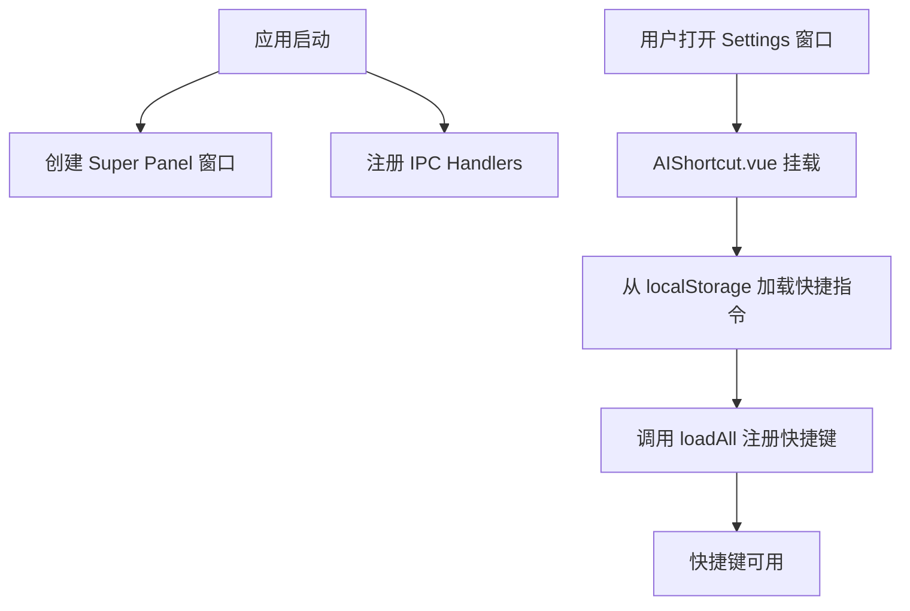
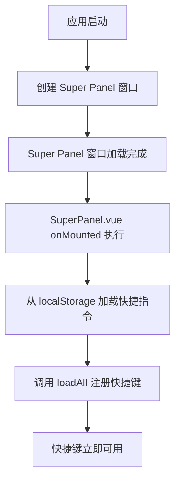

# AI 快捷指令快捷键初始化修复

## 问题描述

**症状**：

- ❌ 应用刚启动后，按 AI 快捷指令设置的快捷键不起作用
- ✅ 打开配置面板后，再按快捷键就能正常触发

**影响**：
用户无法在启动后立即使用 AI 快捷指令的快捷键功能，必须先打开设置窗口，导致用户体验不佳。

## 根本原因分析

### 原来的初始化流程



**问题**：

1. Settings 窗口只有在用户点击打开时才会创建
2. `AIShortcut.vue` 组件的 `onMounted` 钩子才会执行
3. 只有在 `onMounted` 中才会从 localStorage 加载快捷指令并注册快捷键
4. **因此，应用启动时快捷键没有被注册！**

### 代码分析

**问题代码位置**：`src/renderer/src/components/settings/AIShortcut.vue` (296-317行)

```typescript
// 初始化
onMounted(async () => {
  // 初始化 store（从 localStorage 加载）
  store.initialize()

  // 加载所有快捷指令的快捷键到主进程
  const shortcuts = store.shortcuts.map((s) => ({
    id: s.id,
    name: s.name,
    icon: s.icon,
    prompt: s.prompt,
    hotkey: s.hotkey
  }))

  if (shortcuts.length > 0) {
    try {
      const count = await window.api.aiShortcutHotkey.loadAll(shortcuts)
      console.log(`Loaded ${count} shortcut hotkeys`)
    } catch (error) {
      console.error('Failed to load shortcut hotkeys:', error)
    }
  }
})
```

**问题**：这段代码只在打开 Settings 窗口时才执行！

## 解决方案

### 新的初始化流程



**关键改进**：

- ✅ 在 Super Panel 初始化时就加载快捷键
- ✅ Super Panel 是应用启动时就创建的窗口
- ✅ 不需要等待用户打开 Settings 窗口

### 实现细节

**修改文件**：`src/renderer/src/SuperPanel.vue`

```typescript
// 导入 AI 快捷指令 Store
import { useAIShortcutStore } from './stores/aiShortcut'

// 在 onMounted 中添加快捷键加载逻辑
onMounted(async () => {
  window.electron.ipcRenderer.on('super-panel:reset-pinned', handleResetPinned)
  window.addEventListener('keydown', handleKeyDown)

  // 🔑 在应用启动时加载 AI 快捷指令的快捷键
  try {
    console.log('[SuperPanel] Initializing AI shortcut hotkeys...')
    const aiShortcutStore = useAIShortcutStore()

    // 从 localStorage 加载快捷指令数据
    aiShortcutStore.initialize()

    // 提取所有有快捷键的指令
    const shortcuts = aiShortcutStore.shortcuts.map((s) => ({
      id: s.id,
      name: s.name,
      icon: s.icon,
      prompt: s.prompt,
      hotkey: s.hotkey
    }))

    // 如果有快捷键，注册到主进程
    if (shortcuts.length > 0 && window.api?.aiShortcutHotkey?.loadAll) {
      const count = await window.api.aiShortcutHotkey.loadAll(shortcuts)
      console.log(`[SuperPanel] Successfully loaded ${count} AI shortcut hotkeys`)
    } else {
      console.log('[SuperPanel] No AI shortcuts with hotkeys found')
    }
  } catch (error) {
    console.error('[SuperPanel] Failed to load AI shortcut hotkeys:', error)
  }
})
```

## 修复效果

### Before (修复前)

```
1. 用户启动应用
2. 按下设置的快捷键 (例如: Ctrl+Shift+T)
3. ❌ 没有反应
4. 用户打开 Settings 窗口
5. 再次按下快捷键
6. ✅ 快捷键触发
```

### After (修复后)

```
1. 用户启动应用
2. Super Panel 自动加载快捷键
3. 按下设置的快捷键 (例如: Ctrl+Shift+T)
4. ✅ 快捷键立即触发！
```

## 技术细节

### 为什么选择 Super Panel？

1. **启动时创建**：Super Panel 在应用启动时就被创建（`src/main/index.ts` 第131行）

   ```typescript
   app.whenReady().then(() => {
     createSuperPanelWindow() // 启动时就创建
     // ...
   })
   ```

2. **持久存在**：Super Panel 窗口一直存在（只是隐藏），不会被销毁

3. **已有 localStorage 访问**：Super Panel 已经在使用 Vue Store 系统

4. **合理的职责**：作为应用的主面板，负责初始化全局功能是合理的

### 数据流

```
localStorage (浏览器存储)
    ↓
AIShortcutStore.initialize() (读取数据)
    ↓
useAIShortcutStore().shortcuts (Vue Store)
    ↓
window.api.aiShortcutHotkey.loadAll() (IPC 调用)
    ↓
aiShortcutRunnerHandlers.ts (主进程 IPC Handler)
    ↓
registerShortcutHotkey() (注册快捷键)
    ↓
mouseListener.ts (监听键盘事件)
    ↓
checkShortcutHotkeyTriggered() (检测快捷键)
    ↓
triggerShortcut() (触发 AI 快捷指令)
```

## 兼容性

### 向后兼容

✅ **完全兼容**：原有的 Settings 窗口中的快捷键加载逻辑保持不变。

**好处**：

1. Settings 窗口打开时，会再次调用 `loadAll`，确保快捷键是最新的
2. 如果用户在 Settings 中修改了快捷键，会立即重新注册
3. 双重保险机制，更加可靠

### 重复注册处理

`registerShortcutHotkey` 函数已经处理了重复注册的情况：

```typescript
// 先注销旧的快捷键（如果存在）
unregisterShortcutHotkey(shortcutId)

// 再注册新的快捷键
// ...
```

因此，多次调用 `loadAll` 不会造成问题。

## 测试验证

### 测试步骤

1. **启动测试**
   - [ ] 启动应用
   - [ ] 等待 Super Panel 加载完成（检查控制台日志）
   - [ ] 查看日志：`[SuperPanel] Successfully loaded X AI shortcut hotkeys`
2. **快捷键测试**
   - [ ] 不打开 Settings 窗口
   - [ ] 直接按设置的快捷键
   - [ ] ✅ 验证 AI Shortcut Runner 窗口弹出
3. **修改测试**
   - [ ] 打开 Settings 窗口
   - [ ] 修改快捷键
   - [ ] 关闭 Settings 窗口
   - [ ] 按新的快捷键
   - [ ] ✅ 验证新快捷键生效

4. **控制台日志验证**
   ```
   [SuperPanel] Initializing AI shortcut hotkeys...
   [SuperPanel] Successfully loaded 3 AI shortcut hotkeys
   [AIShortcutHotkeyManager] Registered hotkey Ctrl+Shift+T for shortcut "翻译" (xxx-xxx)
   ```

## 性能影响

### 启动时间

- **影响**：微乎其微（< 10ms）
- **原因**：
  - localStorage 读取很快
  - 数据量小（通常只有几个快捷指令）
  - 异步执行，不阻塞 UI

### 内存占用

- **影响**：无显著增加
- **原因**：
  - AI Shortcut Store 在打开 Settings 时也会被创建
  - 现在只是提前初始化
  - 数据已经在 localStorage 中

## 相关文件

### 修改的文件

- `src/renderer/src/SuperPanel.vue` - 添加快捷键初始化逻辑

### 相关文件（未修改）

- `src/renderer/src/components/settings/AIShortcut.vue` - 保留原有逻辑
- `src/main/modules/aiShortcutRunnerHandlers.ts` - IPC handlers
- `src/main/modules/aiShortcutHotkeyManager.ts` - 快捷键管理
- `src/renderer/src/stores/aiShortcut.ts` - AI 快捷指令 Store

## 后续优化建议

### 1. 使用 electron-store

**当前方案**：localStorage (渲染进程)
**优化方案**：electron-store (主进程)

**优点**：

- 主进程可以直接读取数据
- 不需要等待窗口加载
- 更快的启动速度

**缺点**：

- 需要重构数据存储层
- 需要迁移现有数据

### 2. 延迟加载优化

如果快捷指令数量很多（> 100个），可以考虑：

- 只加载有快捷键的指令
- 按需加载指令详情

### 3. 错误恢复机制

如果快捷键加载失败：

- 显示通知提醒用户
- 提供手动重新加载的按钮
- 自动重试机制

## 总结

这次修复解决了 AI 快捷指令快捷键在应用启动时无法使用的问题。通过将快捷键加载逻辑从 Settings 窗口移到 Super Panel 的初始化过程中，确保了快捷键在应用启动时就被注册，大大提升了用户体验。

**关键要点**：

- ✅ 快捷键在应用启动时立即可用
- ✅ 不需要打开 Settings 窗口
- ✅ 保持了向后兼容性
- ✅ 无性能负担
- ✅ 代码简洁清晰
